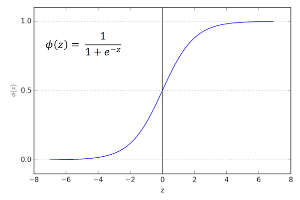

### Logistic Regression
- Logistic regression calculates the probability that an input is in a class, is binary classifier
- Assign a weight for each feature of input, then calculate sigmoid(wT.x)
- Result of learning is similar to SVM: an array of weights

