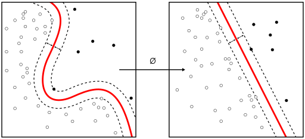
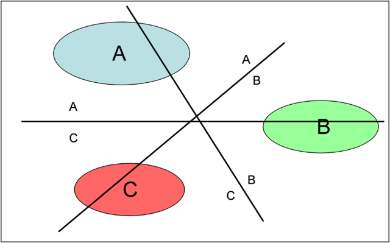

### Support Vector Machine (SVM)
- SVMs are supervised learning models, non-probabilistic binary linear classifier.

- can use kernel to map input into higher-dimensional feature spaces to make non-linear classification.

- Multiclass approach: dominant approach is to reduce single multiclass problem into multiple binary classification. Classify k classes:
    - 1 vs all: build k SVMs, each separates a single class from all remaining classes, class with highest output function assigns the classification
    
    
    
    - 1 vs 1: build k(k-1)/2 SVMs, each separates a pair of classes, class assigned has votes increased by 1, class with most votes determines the classification
    
    